# Integration of Envizi and Supplychain Intelligent suite

## Usecase:

## Pre-requisites 

### Envizi:
1. Define Organization hierarchy and locations in Envizi
2. Extract location and location reference

### SCIS :
1. Identify the Factor codes for the products purchased.

## Steps to Follow 

1. Prepare **Master data**
   1. Download the sample files
   2. Prepare master data files
   3. Upload the master data into SCIS
   4. Prepare Orders and Orderlines
   5. Upload Order and Orderlines

2. Prepare **Oder data**
   1. Prepare Orders and Orderlines
   2. Upload Order and Orderlines

3. Verify data uploaded from **Data Explorer**

4. Identiy and **Prioritize the Suppliers / Products**

5. Engage with Supplier - **Request PCF for product**
   
6. Capture the PCF data from Suppliers
   1. Manual upload of PCF data
   2. Using Supplier Portal

7.  Explore the PCF requests received 
8.  Explore Data quality of PCF requests
9.  Verify the Emissions using Emission management
10. Export the Emission data to Envizi

## Step 1 : Prepare Master data

### Step 1.1 : Download the sample files

Download the sample files from the  [IBM Envizi Supply Chain Intelligence](https://www.ibm.com/docs/en/envizi-supply-chain?topic=configuring-sample-files) 

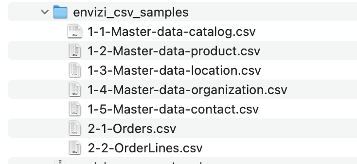

### Step 1.2 : Prepare master data files

### Step 1.3 : Upload the master data into SCIS

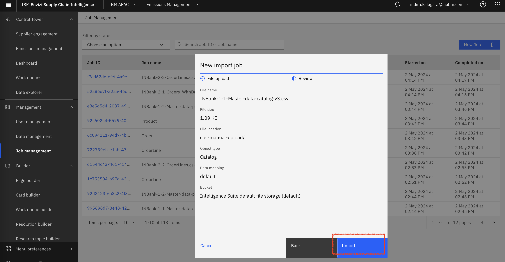

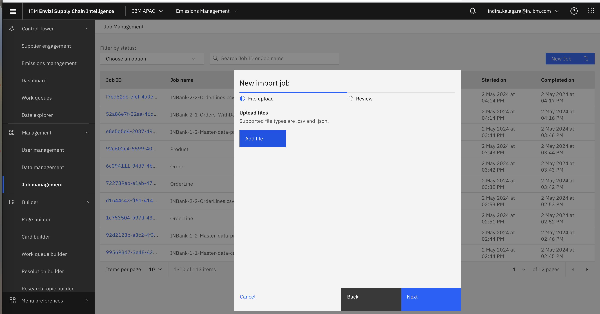

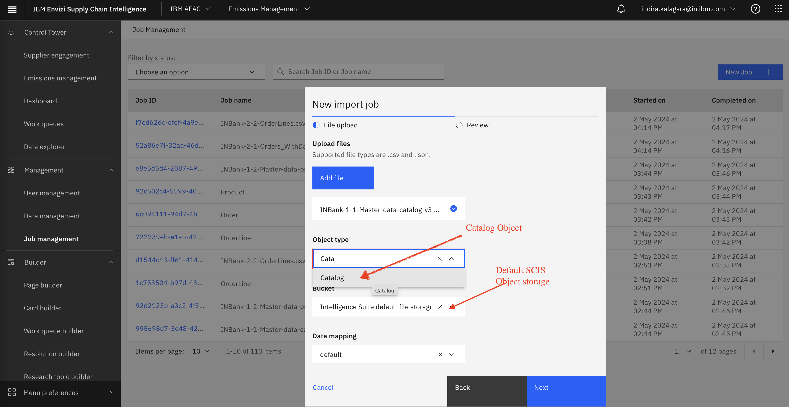

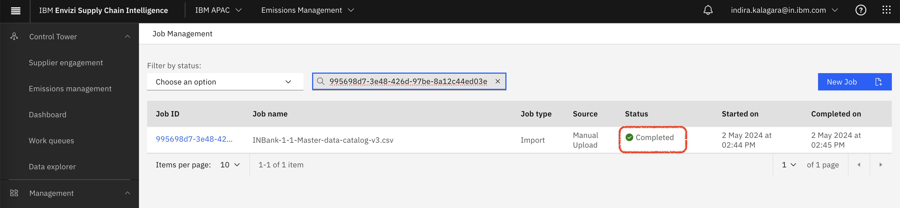

### Step 1.4 : Prepare Orders and Orderlines

### Step 1.5 : Upload Order and Orderlines

## Step 2 : Prepare Oder data

### Step 2.1 : Prepare Orders and Orderlines
### Step 2.2 : Upload Order and Orderlines

## Step 3 : Verify data uploaded from **Data Explorer**

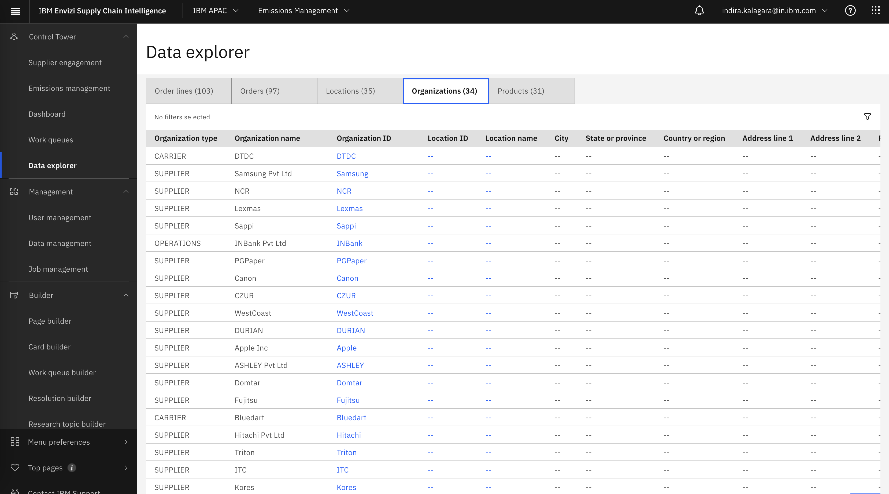

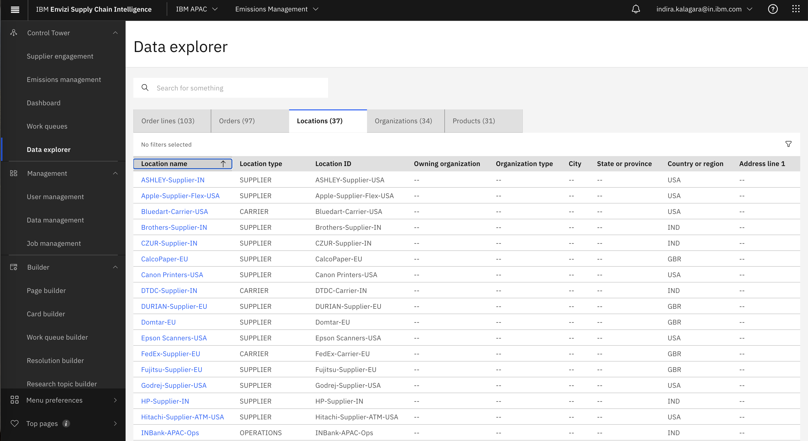

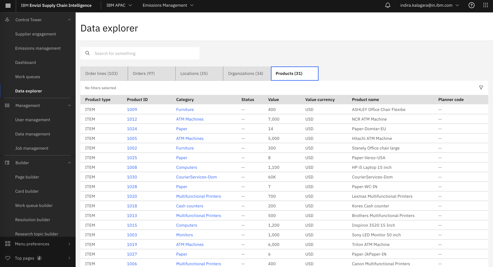

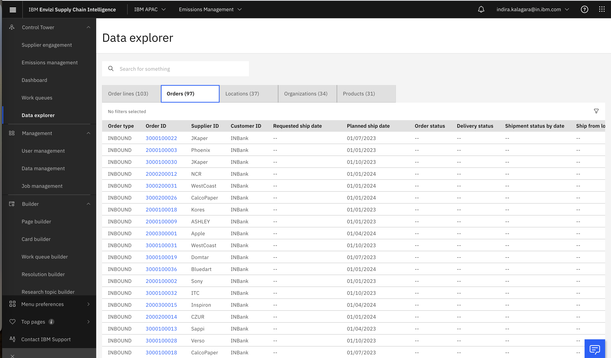

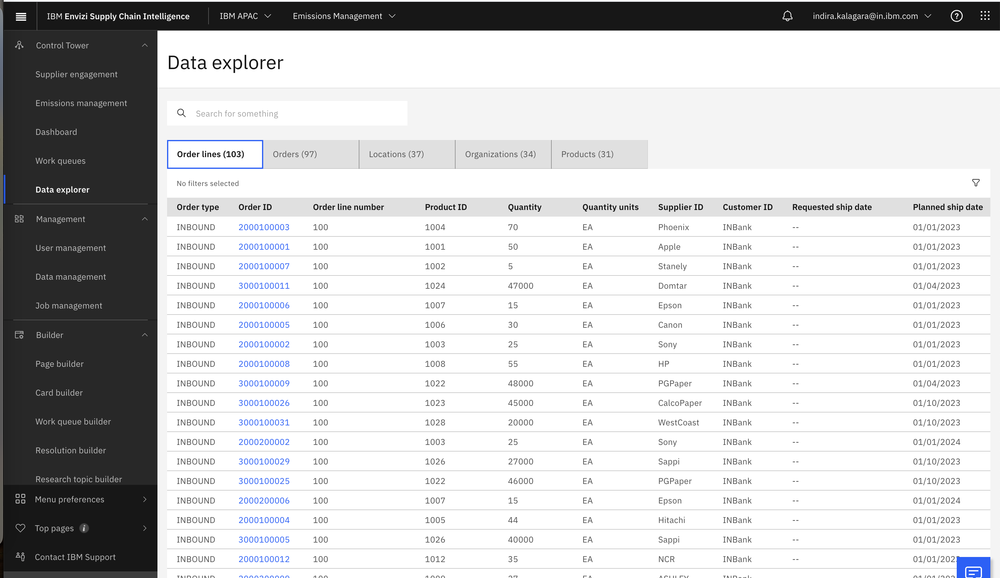

## Step 4 : Identiy and Prioritize the Suppliers / Products
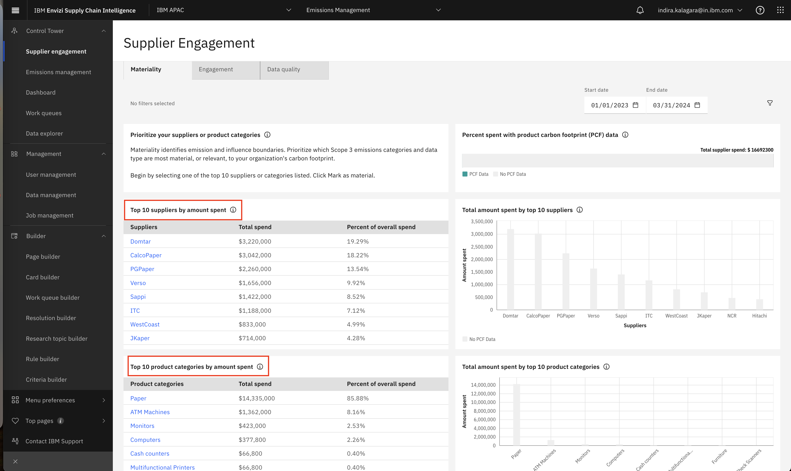

## Step 5 : Engage with Supplier - Request PCF for product

## Step 6 : Supplier provides the PCF form
### Step 6.1 : Manual upload of PCF data
### Step 6.2 : Using Supplier Portal

## Step 7 : Explore the PCF requests received 

## Step 8 : Explore Data quality of PCF requests
## Step 9 : Verify the Emissions using Emission management
## Step 10 : Export the Emission data to Envizi
